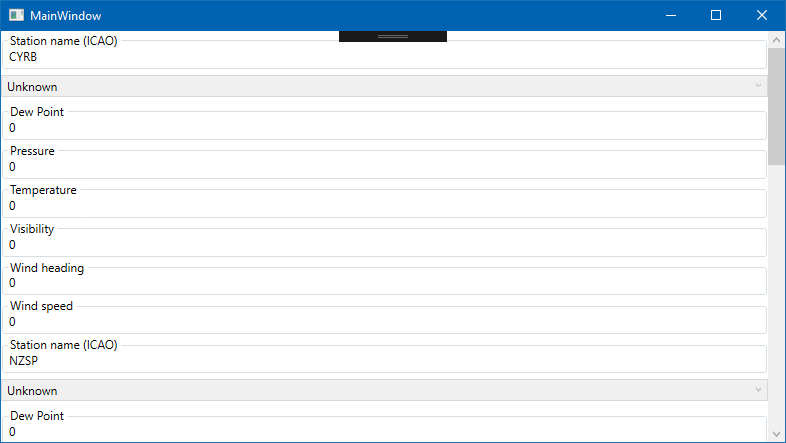
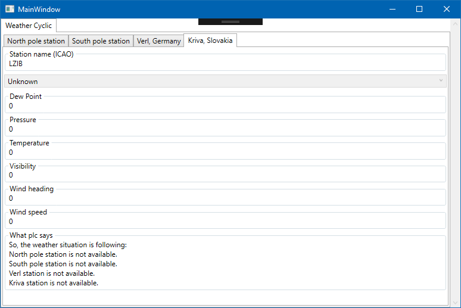
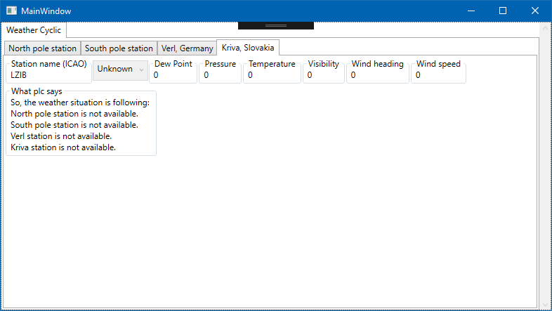
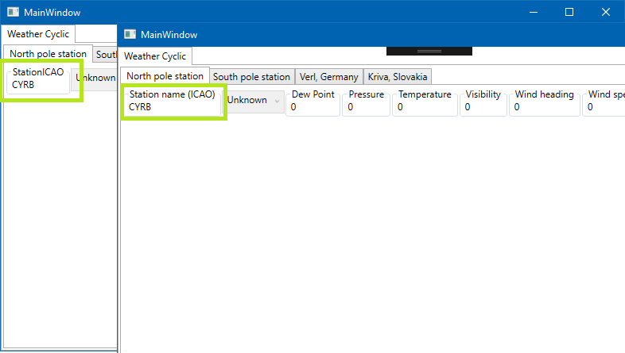
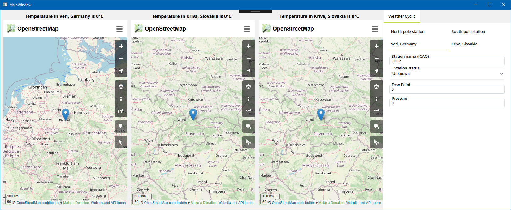
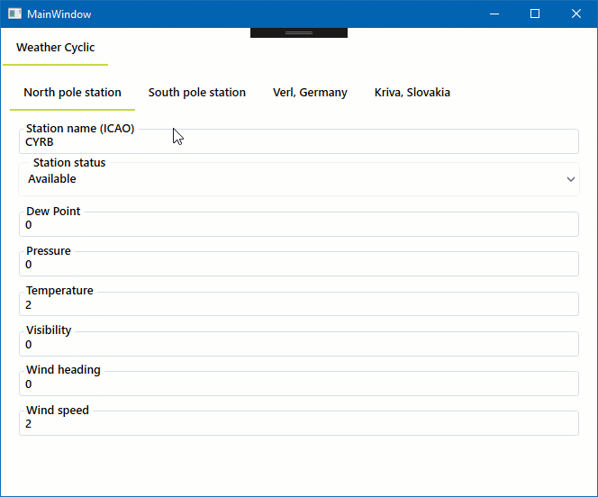

# Inxton.Package.Vortex.Essentials

*Inxton.Package.Vortex.Essentials* extends [Inxton.Package.Vortex.Core](https://github.com/Inxton/Inxton.Package.Vortex.Core) with libraries for **auto-generating user interface** (HMI). Automated UI generation provides you with a fast and highly scalable way of presenting PLC object. Any change of the PLC object reflects automatically in the generated UI. This approach saves a lot of time and lets you focus on core problem solving instead of spending time with adjusting user interface; it reduces the errors that are often introduced by routine linking of PLC to HMI.  

This project is part of [Inxton.Vortex.Framework](https://github.com/Inxton/Inxton.Vortex.Framework). At this point, it contains libraries for [Windows Presentation Foundation (WPF)](https://docs.microsoft.com/en-us/dotnet/framework/wpf/introduction-to-wpf). Other presentation frameworks are in the making, such as support for ASP.NET and UWP.

## What's inside *Inxton.Package.Vortex.Essentials* package

- **Inxton.Vortex.Presentation.Controls.Wpf** - User interface for basic controls [API](API/Vortex.Presentation.Controls.Wpf.Documentation/_Sidebar.md)
- **Inxton.Vortex.Presentation.Styling.Wpf** - Styling with Material design in mind
- **Inxton.Vortex.Presentation.Wpf** - Engine for generating user interface, layouts [API](API/Vortex.Presentation.Wpf.Documentation/_Sidebar.md)

# Getting started

## Check the prerequisites

Make sure you have everything you need to start using examples in this repository [here](https://github.com/Inxton/documentation/blob/master/PREREQUISITES.MD).

If you are not familiar with INXTON, make sure you understand the basics [Inxton.Package.Vortex.Core](https://github.com/Inxton/Examples-Inxton.Package.Vortex.Core/).

## Required NuGet packages

Make sure you install following NuGet packages.

For TwinConnector project:

https://www.nuget.org/packages/Inxton.Package.Vortex.Essentials/
~~~ bash
Install-Package Inxton.Package.Vortex.Essentials
~~~

For your WPF application:

https://www.nuget.org/packages/Inxton.Package.Vortex.Essentials.Wpf/
~~~ bash
Install-Package Inxton.Package.Vortex.Essentials.Wpf
~~~

## Installing license

To run your Inxton application, you need to have a valid license. The preview license file is provided completely free of charge. 
It's simple, just grab it by following these steps. 

Easy installation steps:
1. Dowload **Licence.xml** file from github environment [here](http://bit.ly/future_of_automation) or as raw format [here](https://bit.ly/2w8nFbT).
2. Don't forget to save licence as **.xml** file.
3. Copy/Move licence into **'C:\Inxton\Licence.xml'** folder.

> **Note:** *Preview licence is valid until 2020-SEPT-01. Don't worry; you should be fine, the full release is coming out in July 2020.*

## How to generate UI

We are using project [Weather Stations](https://github.com/Inxton/Examples-Inxton.Package.Vortex.Core/tree/master/WeatherStations) from  [Examples-Inxton.Package.Vortex.Core](https://github.com/Inxton/Examples-Inxton.Package.Vortex.Core)

To generate UI, you need a `[YourPlcProjectName]Connector` project in your solution and a [connected instance of a controller](https://github.com/Inxton/Examples-Inxton.Package.Vortex.Core/#connect-your-app-to-your-plc)

~~~csharp
using HansPlc;
using System.Windows;

namespace Weather.Essentials.Wpf
{
    public partial class MainWindow : Window
    {
        public MainWindow()
        {
            InitializeComponent();
            DataContext = new MainWindowViewModel();
        }
    }

    public class MainWindowViewModel
    {
        public MainWindowViewModel()
        {
            Entry.HansPlc.Connector.BuildAndStart();
            PLC = Entry.HansPlc;
        }
        public HansPlcTwinController PLC { get; }
    }
}

~~~
In your WPF project, add this line to the XAML definition.   

~~~ XML
xmlns:vortex="http://vortex.mts/xaml"
~~~

Use `RenderableContentControl` and bind to the PLC object you want to render.
~~~xml
<vortex:RenderableContentControl DataContext="{Binding PLC.prgWeatherStations._weatherStationsCyclicAccess}" />
~~~

#### Result 

### How to make it editable

Set `PresentationType` property to `Control`
~~~xml
<vortex:RenderableContentControl DataContext="{Binding MAIN.TwinObject}" PresentationType="Control"/>
~~~

### How to change the rendering layout

Use `attribute wpf [Container(Layout.LAYOUT_ORCHESTRATION)] `

Let's say you want to have each weather station in a separate tab. Add the attribute `wpf` to the `fbWorldWeatherWatch` 
~~~
{attribute wpf [Container(Layout.Tabs)]}
FUNCTION_BLOCK fbWorldWeatherWatch
VAR 
    {attribute addProperty Name "<#North pole station#>"}
    NorthPole : structWeatherStation := (StationICAO := 'CYRB');
    {attribute addProperty Name "<#South pole station#>"}
    SouthPole : structWeatherStation := (StationICAO := 'NZSP');
    {attribute addProperty Name "<#Verl, Germany#>"}
    Verl : structWeatherStation := (StationICAO := 'EDLP');
    {attribute addProperty Name "<#Kriva, Slovakia#>"}
    Kriva : structWeatherStation := (StationICAO := 'LZIB');
    {attribute addProperty Name "<#What plc says#>"}
    PlcCommentOnCurrentWeather : STRING(255) := 'TEST';
END_VAR
~~~

And `structWeatherStation`
~~~
{attribute wpf [Container(Layout.Stack)]}
TYPE structWeatherStation:
~~~

#### Result

In case you use 
~~~
{attribute wpf [Container(Layout.Wrap)]}
TYPE structWeatherStation:
~~~

Available layout orchestration : `Stack,Wrap,Tabs,Tree,Scroll,GroupBox,Border,UniformGrid`

### How to change the variable name

If you want to display a different name for your variable, simply add the attribute Name
~~~
{attribute addProperty Name "<#Station name (ICAO)#>"}  
StationICAO : STRING(4);
~~~

> NOTE: Tags `<#` `#>` are optional. The string within the tags is used to localize your application.

### How to ignore a variable

If you don't want to render a variable use  `{attribute clr [RenderIgnore()]}`
~~~
{attribute clr [RenderIgnore()]}
Password : STRING(4);
{attribute clr [RenderIgnore("Operator","Control")]}  // will ignore the variable only in  "Operator" and "Control" presentation type
UserId : STRING(4);
~~~

If don't want to render a variable in a specific presentation type `{attribute clr [RenderIgnore("Kriva")]}`

> NOTE: You'll learn about the presentation type bellow.

### How to change the default container

Views inside `RenderableContentControl` in a `StackPanel` by default. 

To change it to a `Grid` you do the following.

~~~xml
<vortex:RenderableContentControl DataContext="{Binding MAIN.TwinObject}" >
    <vortex:RenderableContentControl.RootContainer>
        <Grid>
    </vortex:RenderableContentControl.RootContainer>
</vortex:RenderableContentControl>

~~~
### How to create a custom view

- Let's have FB `fbWorldWeatherWatch`. To customize the view for this object Create `fbWorldWeatherWatchView` UserControl in .NET

Don't forget to update *namespaces*  in `x:Class`  in the XAML definition and code-behind. It has to match the namespace of generated classes.

~~~xml
<UserControl
    x:Class="HansPlc.fbWorldWeatherWatchView"
    xmlns="http://schemas.microsoft.com/winfx/2006/xaml/presentation"
    xmlns:x="http://schemas.microsoft.com/winfx/2006/xaml">
    <StackPanel>
        <TextBlock
            FontSize="15"
            FontWeight="Bold"
            Text="{Binding Verl.Temp.Cyclic, StringFormat={}Temperature in Verl\, Germany is {0}°C}" />
        <TextBlock
            FontSize="15"
            FontWeight="Bold"
            Text="{Binding Kriva.Temp.Cyclic, StringFormat={}Temperature in Kriva\, Slovakia is {0}°C}" />
    </StackPanel>
</UserControl>

~~~
and the namespace in the code-behind
~~~csharp
namespace HansPlc
{
    public partial class fbWorldWeatherWatchView : UserControl
    {
        public fbWorldWeatherWatchView()
        {
            InitializeComponent();
        }
    }
}
~~~

Inxton automatically injects your view.

#### Result

### How display a different view for same object
#### Presentation type

You have one object in your PLC with you want to display in many ways - Manual view for maintenance, read-only view for operators. And it's easy to do!

All you have to do is to create a custom view, as is shown in the example above with a slight change.

Create `fbWorldWeatherWatchVerlView` =  `fbWorldWeatherWatch`+`Verl`+`View`
~~~xml
<UserControl
    x:Class="HansPlc.fbWorldWeatherWatchVerlView"
    xmlns="http://schemas.microsoft.com/winfx/2006/xaml/presentation"
    xmlns:x="http://schemas.microsoft.com/winfx/2006/xaml">
    <Grid>
        <StackPanel Margin="10">
            <TextBlock
                HorizontalAlignment="Center"
                FontSize="15"
                FontWeight="Bold"
                Text="{Binding Verl.Temp.Cyclic, StringFormat={}Temperature in Verl\, Germany is {0}°C}" />
            <WebBrowser
                x:Name="Map"
                Width="400"
                Height="600" />
        </StackPanel>
    </Grid>
</UserControl>
~~~
Create `fbWorldWeatherWatchKrivaView` =  `fbWorldWeatherWatch`+ `Kriva` +`View`
~~~xml
<UserControl
    x:Class="HansPlc.fbWorldWeatherWatchKrivaView"
    xmlns="http://schemas.microsoft.com/winfx/2006/xaml/presentation"
    xmlns:x="http://schemas.microsoft.com/winfx/2006/xaml">
    <Grid>
        <StackPanel Margin="10">
            <TextBlock
                HorizontalAlignment="Center"
                FontSize="15"
                FontWeight="Bold"
                Text="{Binding Kriva.Temp.Cyclic, StringFormat={}Temperature in Kriva\, Slovakia is {0}°C}" />
            <WebBrowser
                x:Name="Map"
                Width="400"
                Height="600" />
        </StackPanel>
    </Grid>
</UserControl>
~~~

In the codebehind constructor needs this line of code:

~~~csharp
Map.Navigate("https://www.openstreetmap.org/?mlat=51.876&mlon=8.525#map=6/51.876/8.525");
~~~

And in the MainViewWindow.xaml use the `PresentationType` property and set it to your own. If the PresentationType doesn't exist, you can use `-` operator to set an order fallback presentation. If PresentationType is not defined at all, Inxton will use `fbWorldWeatherWatchView` - View without any presentation type.

~~~xml
<UniformGrid Columns="4">
   <vortex:RenderableContentControl DataContext="{Binding PLC.prgWeatherStations._weatherStationsCyclicAccess}" PresentationType="Verl" />
            <vortex:RenderableContentControl DataContext="{Binding PLC.prgWeatherStations._weatherStationsCyclicAccess}" PresentationType="Kriva" />
            <vortex:RenderableContentControl DataContext="{Binding PLC.prgWeatherStations._weatherStationsCyclicAccess}" PresentationType="Atlantis-Kriva-Verl" />
            <vortex:RenderableContentControl DataContext="{Binding PLC.prgWeatherStations._weatherStationsCyclicAccess}" />
</UniformGrid>
~~~

#### Result

### How to apply styles

Add these resources to `App.xaml`.

~~~xml
<Application.Resources>
    <ResourceDictionary>
        <ResourceDictionary.MergedDictionaries>
            <ResourceDictionary Source="pack://application:,,,/Vortex.Presentation.Styling.Wpf;component/VortexStyle.xaml" />
        </ResourceDictionary.MergedDictionaries>
    </ResourceDictionary>
</Application.Resources>
~~~

#### Result

Learn more about styles [here](./Styles/README.md)

## What to do next?

Checkout documentation  [Inxton.Package.Vortex.Core](https://github.com/Inxton/documentation).

Learn more about [how it works](Inxton.Vortex.Presentation.Wpf/README.md).

Learn more about styles [here](./Styles/README.md).

Install the extension from [Visual Studio Marketplace](https://marketplace.visualstudio.com/items?itemName=Inxton.InxtonVortexBuilderExtensionPre).

# Need help?

🧪 Create an issue [here](https://github.com/Inxton/Feedback/issues/new/choose)

📫 We use mail too team@inxton.com 

🐤 Contact us on Twitter [@Inxton](https://twitter.com/inxtonteam)

📽 Check out our [YouTube](https://www.youtube.com/channel/UCB3EcnWyLSsV5gqSt8PRDXA/featured)

🌐 For more info check out our website [INXTON.com](https://www.inxton.com/)

# Contributing

We are more than happy to hear your feedback, ideas!
Just submit it [here](https://github.com/Inxton/Feedback/issues/new/choose)  

# License
TLDR
> Developers are encouraged to use this project -  free of charge. However, when you want to use it in the production environment, you need to go to  [INXTON.com](https://www.inxton.com/) and purchase a license.

to make our lawyers happy - read the whole license agreement [here](https://github.com/Inxton/about/blob/master/license.md)

---
Developed with ♥ at [MTS](https://www.mts.sk/en) - putting the heart into manufacturing.
